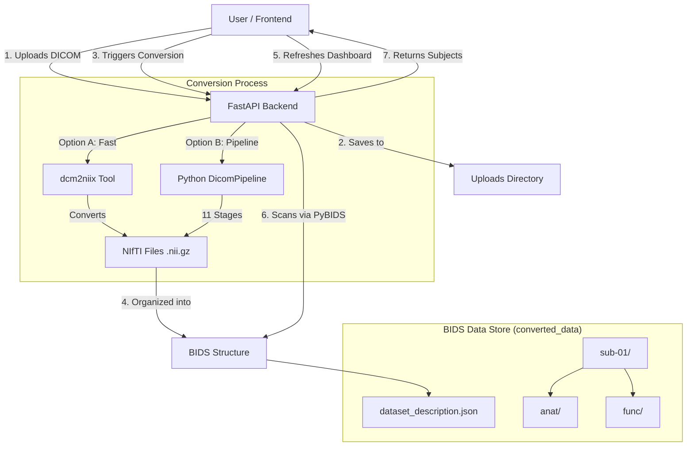

# fMRI Preprocessing System Flow

This document outlines the end-to-end data flow of the fMRI application, explaining how files move from your computer to the dashboard and the role of each component.

## High-Level Architecture

## Step-by-Step Workflow

### 1. Data Ingestion (Upload)
*   **Action**: You drag and drop files or use the generic "Upload" endpoint.
*   **System**: The frontend sends files to `http://localhost:8000/datasets/upload`.
*   **Result**: Raw DICOM files are saved in `fmri_preproc/uploads/<timestamp>/`.

### 2. Conversion Trigger
*   **Action**: You select "Import" > "Raw DICOM" or use the "Pipeline Converter" modal.
*   **System**: The frontend calls `POST /convert/dicom`.
*   **Choices**:
    *   **Standard (dcm2niix)**: Calls the external C++ tool `dcm2niix`. It's fast and robust.
    *   **Python Pipeline**: Runs our custom 11-stage Python script (`DicomPipeline`). This gives granular progress (e.g., "Stage 4: Slice Sorting").

### 3. The "BIDS" Organization (Crucial Step)
The system doesn't just save files anywhere. It follows the **BIDS (Brain Imaging Data Structure)** standard.

*   **Output Folder**: `fmri_preproc/converted_data/`
*   **Subject Folder**: `sub-01/`
*   **Type Subfolders**: 
    *   `anat/` for T1w images (Structural).
    *   `func/` for BOLD images (Functional).
*   **The Identifier**: `dataset_description.json`
    *   **Why it failed before**: `pybids` (the library used to read the data) **requires** this file to exist in the root of the dataset (`converted_data/`). Without it, it thinks the folder is just random files, not a valid dataset.
    *   **The Fix**: We ensured this file is created automatically in `converted_data/` whenever a conversion runs.

### 4. Data Discovery (Dashboard)
*   **Action**: The Dashboard loads.
*   **System**: It calls `GET /datasets/available` and `POST /datasets/subjects`.
*   **Logic**: The backend looks at `converted_data`. It sees `dataset_description.json`, so it knows it's a dataset. Then it looks for folders starting with `sub-`.
*   **Result**: "sub-01" appears in your list.

### 5. Visualization
*   **Action**: You click "Pipeline Details" or view the subject.
*   **System**: The frontend creates a viewer URL (e.g., `/files/sub-01/func/image.nii.gz`). The backend serves the `converted_data` folder as static files, allowing the NIfTI viewer to download and render the brain scan.
